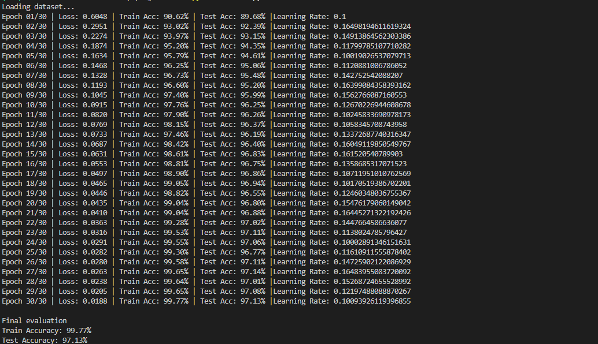

# Neural Network From Scratch: ScratchTorch to NumPy Tensors

This project is a from-scratch neural-network playground built around a small
ScratchTorch-style autodiff engine. It started with scalar `Value` objects for
learning backpropagation step by step, then evolved into a faster NumPy-backed
`Tensor` engine that can train a batched MNIST-style digit classifier.

The goal is educational: keep every part of forward propagation, automatic
differentiation, and training visible, while still making the implementation
fast enough to run useful experiments.

---

## Results

The current classifier trains on the CSV image dataset in `dataset/train.csv`
using an 80:20 train/test split.



---

## What's in this repo

- `train.py` - current training script for the optimized tensor-based
  classifier.
- `ScratchTorch/grad.py` - core autodiff code:
  - `Value`: original scalar ScratchTorch implementation.
  - `Tensor`: optimized NumPy-backed autodiff class for arrays and batches.
  - `conv2d()`: convolution operation with backpropagation support for 2D
    image kernels.
- `ScratchTorch/nn.py` - neural-network building blocks:
  - deprecated scalar `Neuron_value`, `Layer_value`, and `MLP_value`.
  - tensor-based `Layer`, `MLP`, and `ClassifcationNN`.
  - `Conv2d`: convolutional layer for building CNN architectures.
- `resources/prediction.png` - saved prediction/result image.
- `cnn.ipynb` - exploratory notebook for CNN experiments and visualizations.
- `basic-neural-network-from-scratch.ipynb` - original notebook exploring the
  MLP classifier.
- `multilayer-perceptron.py` - older MLP experiment using the original
  ScratchTorch-style flow.
- `dataset/` - expected location for `train.csv` and `test.csv`.

---

## What changed in ScratchTorch

The original version used scalar `Value` objects and plain Python arithmetic.
That made the mechanics of backpropagation easy to understand, but it was very
slow for image classification because every input, weight, and operation had to
be handled one value at a time.

The optimized version adds a `Tensor` class that stores data and gradients as
NumPy arrays:

- vectorized addition, subtraction, multiplication, division, powers, and
  exponentials.
- matrix multiplication with `@`, which makes dense layers much faster.
- broadcasting-aware backward passes using an `unbroadcast` step so gradients
  return to the correct original shapes.
- batched gradients, so the model can train on many samples at once.
- `tanh`, `relu`, `log`, `softmax`, and `sum` operations with custom backward
  functions.
- stable softmax using shifted logits before exponentiation.
- graph-based `backward()` with topological sorting, just like the scalar
  ScratchTorch implementation.
- `reset_gradients()` to clear gradients across the computation graph before
  each backward pass.

The older scalar classes are still kept in the code as deprecated references,
which makes it easier to compare the simple version against the optimized one.

---

## Convolution support

The library now includes support for 2D convolution operations with full
backpropagation, enabling CNN architectures:

- `Tensor.conv2d(kernel)`: applies a 2D convolution to image data with
  automatic gradient computation.
- `Conv2d`: layer class for building convolutional neural networks that
  automatically initializes and manages convolution kernels.
- kernel gradient computation enables training convolutional filters
  end-to-end using backpropagation.

This extends ScratchTorch beyond dense networks into the realm of image
processing and computer vision experiments.

---

## Current model and training setup

`train.py` trains a digit classifier with:

- input size: `784` pixels.
- architecture: `ClassifcationNN(784, [64, 64, 10])`.
- hidden activations: `tanh`.
- output activation: `softmax`.
- initialization: LeCun-style weight scaling with `sqrt(1 / nin)`.
- loss: average cross-entropy using one-hot labels and `probs.log()`.
- optimizer: manual gradient descent.
- epochs: `30`.
- batch size: `128`.
- split: shuffled 80 percent training and 20 percent testing.
- seed: NumPy random generator seeded with `150`.
- reporting: average loss, train accuracy, test accuracy, and learning rate
  every epoch.

The training loop now works in batches instead of sample by sample, which is the
main practical speedup. Most heavy math is handled by NumPy while the autodiff
graph and gradient rules remain implemented manually.

---

## Requirements

- Python 3.8+
- `numpy`
- `pandas`
- `matplotlib` for notebook visualization

Install dependencies:

```bash
pip install numpy pandas matplotlib
```

---

## How to train

Make sure the dataset files are available in `dataset/`, then run:

```bash
python train.py
```

The script loads `dataset/train.csv`, normalizes pixel values to the `0-1`
range, shuffles the dataset, trains the classifier, and prints the final train
and test accuracy.

---

## Implementation notes

- The project intentionally avoids PyTorch, TensorFlow, or JAX so the autodiff
  mechanics stay visible.
- The scalar `Value` path is useful for understanding the basics, but the
  tensor path is the one used for the current classifier.
- Softmax is implemented inside the custom `Tensor` class instead of relying on
  a framework loss function.
- Cross-entropy is built from the existing tensor operations:

```python
loss = -(y_true * probs.log()).sum()
loss = loss / len(xb)
```

- Parameters are updated manually:

```python
for p in net.parameters():
    p.data -= learning_rate * p.grad
```

---

## Future plans

- implement additional convolution features: padding, stride, pooling layers.
- extend the `Conv2d` layer with bias terms and activation functions.
- build a full CNN classifier for MNIST and benchmark against the current MLP.
- clean up the learning-rate decay formula and make training hyperparameters
  easier to configure.
- add helper methods for optimization steps so the training loop is cleaner.
- save and load trained weights.
- add prediction visualization directly to the training/evaluation workflow.
